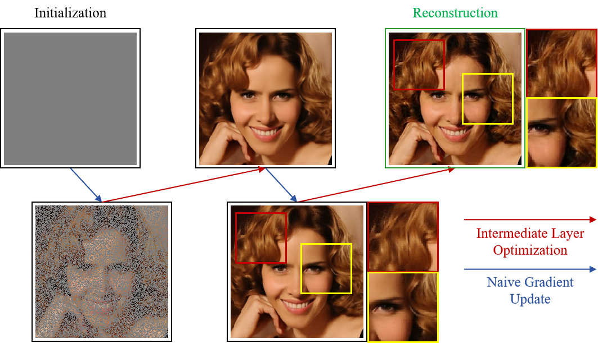

# Integrating Intermediate Layer Optimization and Projected Gradient Descent for Solving Inverse Problems with Diffusion Models (ICML 2025)

This is the official implementation of "Integrating Intermediate Layer Optimization and Projected Gradient Descent for Solving Inverse Problems with Diffusion Models". This paper has been accpeted by [ICML 2025](https://icml.cc/). You can find our paper via [arXiv](https://arxiv.org/abs/2505.20789).

## Abstract
Inverse problems (IPs) involve reconstructing signals from noisy observations. Recently, diffusion models (DMs) have emerged as a powerful framework for solving IPs, achieving remarkable reconstruction performance. However, existing DM-based methods frequently encounter issues such as heavy computational demands and suboptimal convergence. In this work, building upon the idea of the recent work DMPlug, we propose two novel methods, DMILO and DMILO-PGD, to address these challenges. Our first method, DMILO, employs intermediate layer optimization (ILO) to alleviate the memory burden inherent in DMPlug. Additionally, by introducing sparse deviations, we expand the range of DMs, enabling the exploration of underlying signals that may lie outside the range of the diffusion model. We further propose DMILO-PGD, which integrates ILO with projected gradient descent (PGD), thereby reducing the risk of suboptimal convergence. We provide an intuitive theoretical analysis of our approaches under appropriate conditions and validate their superiority through extensive experiments on diverse image datasets, encompassing both linear and nonlinear IPs. Our results demonstrate significant performance gains over state-of-the-art methods, highlighting the effectiveness of DMILO and DMILO-PGD in addressing common challenges in DM-based IP solvers.



## Getting started 

### (1) Clone the repository

```
git clone https://github.com/StarNextDay/DMILO.git

cd DMILO
```


### (2) Download pretrained checkpoint

From the [link](https://onedrive.live.com/?authkey=%21AOIJGI8FUQXvFf8&id=72419B431C262344%21103807&cid=72419B431C262344), download the checkpoint "celebahq_p2.pt" and paste it to ./models/;

From the [link](https://drive.google.com/drive/folders/1jElnRoFv7b31fG0v6pTSQkelbSX3xGZh), download the checkpoint "ffhq_10m.pt" and paste it to ./models/;

From the [link](https://github.com/openai/guided-diffusion), download the checkpoint "lsun_bedroom.pt" and paste it to ./models/.

From the [link](https://drive.google.com/drive/folders/1jElnRoFv7b31fG0v6pTSQkelbSX3xGZh), download the checkpoint "imagenet256.pt" and paste it to ./models/.
```
mkdir models
mv {DOWNLOAD_DIR}/celebahq_p2.pt ./models/
mv {DOWNLOAD_DIR}/ffqh_10m.pt ./models/
mv {DOWNLOAD_DIR}/lsun_bedroom.pt ./models/
mv {DOWNLOAD_DIR}/imagenet256.pt ./models/imagenet.pt
```
{DOWNLOAD_DIR} is the directory that you downloaded checkpoint to.


### (3) Set environment

We use the external codes for motion-blurring and non-linear deblurring.

```
git clone https://github.com/VinAIResearch/blur-kernel-space-exploring bkse

git clone https://github.com/LeviBorodenko/motionblur motionblur
```

From the [link](https://drive.google.com/file/d/1vRoDpIsrTRYZKsOMPNbPcMtFDpCT6Foy/view), download the checkpoint "GOPRO_wVAE.pth" and paste it to ./bkse/experiments/pretrained/.
```
mv {DOWNLOAD_DIR}/GOPRO_wVAE.pt ./bkse/experiments/pretrained/
```
{DOWNLOAD_DIR} is the directory that you downloaded checkpoint to.

Install dependencies

```
conda env create -f environment.yml
conda activate dmilo
```

## Inference
```
### example for Gaussian deblurring task
#### DMILO
python dmilo.py --dataset "celeba" --task "gaussian_deblur" -n 5 --cuda 0
#### DMILO-PGD
python dmilo-pgd.py --dataset "celeba" --task "gaussian_deblur" -n 5 --cuda 0

### example for Super-resolution task
#### DMILO
python dmilo.py --dataset "celeba" --task "super_resolution" -n 5 --cuda 0
#### DMILO-PGD
python dmilo-pgd.py --dataset "celeba" --task "super_resolution" -n 5 --cuda 0

### example for Inpainting task
#### DMILO
python dmilo.py --dataset "celeba" --task "inpainting" -n 5 --cuda 0
#### DMILO-PGD
python dmilo-pgd.py --dataset "celeba" --task "inpainting" -n 5 --cuda 0

### example for Nonlinear deblurring task
#### DMILO
python dmilo.py --dataset "celeba" --task "nonlinear_deblur" -n 5 --cuda 0
#### DMILO-PGD
python dmilo-pgd.py --dataset "celeba" --task "nonlinear_deblur" -n 5 --cuda 0

### example for Motion deblurring task
#### DMILO
python dmilo.py --dataset "celeba" --task "motion_deblur" -n 5 --cuda 0
#### DMILO-PGD
python dmilo-pgd.py --dataset "celeba" --task "motion_deblur" -n 5 --cuda 0
```

## References
This repo is mainly developed based on [DMPlug](https://github.com/sun-umn/DMPlug).
## Citation

If you find our work interesting, please consider citing
```
@inproceedings{zheng2025integrating,
  title = {Integrating intermediate layer optimization and projected gradient descent for solving inverse problems with diffusion models},
  author={Zheng, Yang and Li, Wen and Liu, Zhaoqiang},
  booktitle={ICML},
  year={2025}
}
```